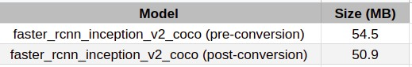

# Project Write-Up

You can use this document as a template for providing your project write-up. However, if you
have a different format you prefer, feel free to use it as long as you answer all required
questions.

## Explaining Custom Layers

There are many Computer Vision model layers that are not supported by OpenVINO toolkit, and a variety of layers in the computer vision model makes it possible to solve different types of computer vision problems. Any layer that is not in the list of supported layers is automatically classified as a custom layer by the Model Optimizer.

The process behind converting custom layers involves...
There are actually a few differences involving converting custom layers depending on model framework, TensorFlow, Caffe etc. 
For TensorFlow:
- First option, the custom layers need to be registered as extensions to the Model Optimizer. 
- Second is to actually replace the unsupported subgraph with a different subgraph and 
- The final option is to actually offload the computation of the subgraph back to TensorFlow during inference.

Some of the potential reasons for handling custom layers are...
- Any layer that is not in the list of supported layers is automatically classified as a custom layer by the Model Optimizer, to actually use the unsupported layers, CPU extension needs to be added.
- The model optimizer is going to throw up an error preventing the use of the model, until the custom layer is properly handled.

## Comparing Model Performance

My method(s) to compare models before and after conversion to Intermediate Representations
were...
The script is written in Tensorflow to measure speed of the pre-converted model while OpenVINO in class workspace was used for post-converted models.

The difference between model accuracy pre- and post-conversion was...
Pre-conversion was theoretically a bit better than Post-conversion given that there is accuracy lost during conversion.

The size of the model pre- and post-conversion was...
frozen_inference_graph.pb = 54.5 MB (pre-conversion)
frozen_inference_graph.bin + frozen_inference_graph.xml = 50.9 MB (post-conversion)
The size of the model was smaller when converted.

The inference time of the model pre- and post-conversion was...
shorter, about 45 sec/frame, for post-converted models than for pre-converted models.

Also, compare the differences in network needs and costs of using cloud services as opposed to deploying at the edge...
- Edge services have low latency and improve performance being that data are collected and processed locally.
- Operational costs are high in cloud service because of the need to host and save models, data migration, bandwidth etc.

## Assess Model Use Cases

Some of the potential use cases of the people counter app are...
- For Traffic control, detecting the number of vehicles on the road at a given time to be able to come up with the best logistic for perfect 
traffic flow. like expanding the road etc.
- For keeping a given number of people in an area, like office, at once. for instance, to control transmission of covid-19, restricting the number of people to give up to 6 feet social distancing. Setting off alarm when the area is getting congested.

Each of these use cases would be useful because...
- They involve solving a current pressing health need and creating an artificial ecosystem for a better society.
- They all involve counting people which is the application of the model and the intention of the project.

## Assess Effects on End User Needs

Lighting, model accuracy, and camera focal length/image size have different effects on a
deployed edge model. The potential effects of each of these are as follows...
The sudden change of illumination is a challenge to detect the accurate moving object
- Poor lighting can affect the performance of the model, sudden change of illumination is a challenge to detect the accurate moving object.
- Low model accuracy can lead to false negative/positive and lead to a poor performance of the application.
- camera focal length/image size: Bad focal length can blur the image making it difficult to be detected given the threshold of the model, the same is also applicable to small size or poor image quality.

## Model Research

[This heading is only required if a suitable model was not found after trying out at least three
different models. However, you may also use this heading to detail how you converted 
a successful model.]

I first converted and used faster_rcnn_inception_v2_coco_2018_01_28 but was getting IndexError: list index out of range a lot which consumes much of my time. I then convert and try ssd_inception_v2_coco_2018_01_28, It didn't take much of my time to get along with the codes as it works well with most of the code in my previous exercise workspace. But I have an issue of detection accuracy that some people in the video were not accurately detected and counted. I have to switch back to faster_rcnn_inception_v2_coco_2018_01_28 and do more research on how to fix IndexError, by reshaping the input shapes on get_input_shape methed (Network class) - Implementation: input_shapes = {input:self.network.inputs[input].shape for input in self.network.inputs}. I was able to get it right, the model has a very good detection accuracy even though it is not fast.

Link to chosen model (Downloaded the model from):
http://download.tensorflow.org/models/object_detection/faster_rcnn_inception_v2_coco_2018_01_28.tar.gz

Unzip the files:
tar -xvf faster_rcnn_inception_v2_coco_2018_01_28.tar.gz

Change into the unzipped folder:
cd faster_rcnn_inception_v2_coco_2018_01_28

Entered into the command line to convert model with the Model Optimizer:
python /opt/intel/openvino/deployment_tools/model_optimizer/mo.py --input_model frozen_inference_graph.pb --tensorflow_object_detection_api_pipeline_config pipeline.config --reverse_input_channels --tensorflow_use_custom_operations_config /opt/intel/openvino/deployment_tools/model_optimizer/extensions/front/tf/faster_rcnn_support.json

Run the command (for Inference):
python main.py -i resources/Pedestrian_Detect_2_1_1.mp4 -m faster_rcnn_inception_v2_coco_2018_01_28/frozen_inference_graph.xml -l /opt/intel/openvino/deployment_tools/inference_engine/lib/intel64/libcpu_extension_sse4.so -d CPU -pt 0.6 | ffmpeg -v warning -f rawvideo -pixel_format bgr24 -video_size 768x432 -framerate 24 -i - http://0.0.0.0:3004/fac.ffm

